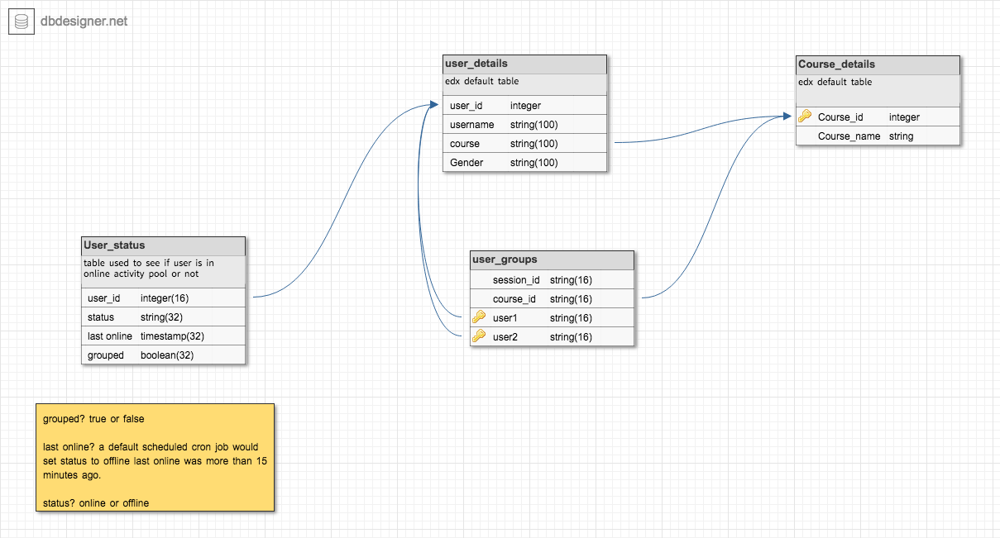
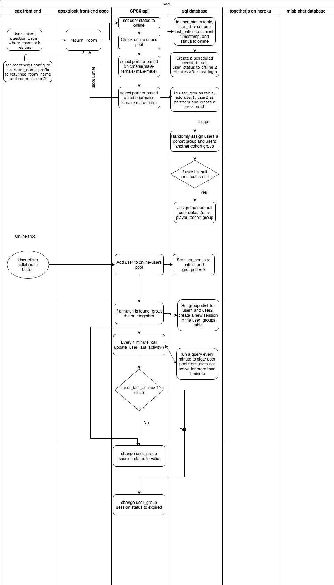

CPSX API

This api is used along with the CPSXBlock in order to communicate with edx database and to manage dynamic partnering, dynamic cohorting and creating online pools for CPSXBlock.

By default, it is served on url:3000/

Currently, the avalaible functions are:

- /onlinePool/
    1. addToUserPool
    2. UserPoolToGrouped
    3. UserPoolToOffline
    4. getUserPool
    5. getAvailablePartners
    6. updateLastOnlineUserPool
    7. pairUsers
    8. updateToDefaultCohort
    9. destroySession

-  /users/getRoom

current schema:

flow diagram of cpsxblock

